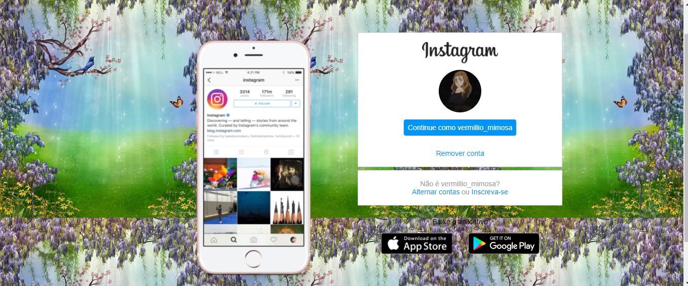

<h1 align ="center">clone_InstagramDio</h1>

 Criando um Clone da Interface do Instagram. Através desse projeto coloquei em prática meus conhecimentos  sobre  Fundamentos do HTML5 e  CSS3. 

<h2>

</h2>

### 🛠️ Tecnologias 

As seguintes ferramentas foram usadas na construção do projeto:

-[HTML5](___________)
-[CSS3: Flexbox e posicionamento de elemento](___________)